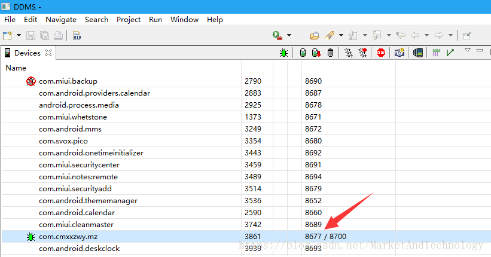

# 通过IDA从内存中DUMP指定的DEX

## 原理
android在运行app时,不管做了多么牛逼的加固,一定会将最终的dex文件加载到内存,通过这个特性,我们只要找到dex在内存的位置,然后dump出来…

### 将dex加载到内存的函数是什么?

* dvm虚拟机:
android版本:4.4(包括)以下
在libdvm.so中的dvmDexFileOpenPartial()函数,R0寄存器指向的地址就是dex文件在内存中的开始地址，R1寄存器就是dex文件的大小

* art虚拟机:
android版本:5.0-7.0
在libart.so中的openMemory()函数R1寄存器指向的地址就是dex文件在内存中的开始地址，R2寄存器就是dex文件的大小

android版本:8.0以上发现没有openMemory()函数，名称为

可以通过
```
adb push /system/lib/libart.so 
```
存放的地址，然后通过ida查看是否有没有这个函数

## 运行环境
前提条件和运行环境一定要写清楚，不然会有很多坑，坑死人。

小米5手机,android7.0开发版,已root  
IDA 是7.0.170914版本  
JDB 使用Java安装目录下的  

## 准备工作

1. 打开usb调试

2. 复制IDA 安装目录下dbgsrv 文件里面的android_server文件到 手机内存储的 /data/local/tmp 目录下

3. 控制台输入 adb shell su 命令获取管理员权限

4. cd /data/local/tmp 进入android_server目录，输入chmod 777 android_server命令获取执行权限

5. ./android_server启动android_server

6. 新开一个命令窗口 不用获取管理员权限
```
adb shell am start -D -n 包名/activity路径 启动应用
adb shell am start -D -n com.cmxxzwy.mz/com.e4a.runtime.android.mainActivity
```

## 打开IDA

菜单 debugger->attach->Remote ARM Linux/android debugger

debug options一定要选


hostname处输入127.0.0.1

点击ok后，在弹出的进程选择框 选择要调试的com.cmxxzwy.mz 进程

手机上的App开始运行后一定要点击IDA 的开始运行按钮。如果有反调试的话，一定要先下断点，不然一运行就崩溃了，一切重新来过。


打开Android Device Minitor


查看 要调试的进程，发现8700端口被占用。可以使用8677端口
```
jdb -connect com.sun.jdi.SocketAttach:hostname=127.0.0.1,port=8677
```
用jdb将app恢复执行。

找到libart.so 的 openMemory方法,在push下面的任意一行按F2下断点

按F9,跳到断点的位置,查看寄存器,R1(开始位置)和R2(大小),注意:这里会走多次,大家可以通过dex的大小做判断,具体dump哪一个

下脚本(按Shift+F2),然后点击run,等待dump完成
```
static main(void){
    auto fp, begin, end, dexbyte;
    //打开或创建一个文件
    fp = fopen("d:\\dump.dex", "wb");
    //dex基址
    begin =  R1;    
    //dex基址 + dex文件大小
    end = begin + R2;
    for ( dexbyte = begin; dexbyte < end;     dexbyte ++ ){
    //按字节将其dump到本地文件中
    fputc(Byte(dexbyte), fp);
	}
}
```

## 常见问题

### 问题描述：
IDA连接android_server 选中进程点ok之后 连接不上报错
提示：
The debugger could not attach to the selected process.
This can perhaps indicate the process was just terminated, or that you dot’t have the necessary privileges. 

#### 原因：
Android5.0之后默认启用了 SELinux/SEAndroid   

#### 解决方法：   
setenforce 0
或者
echo 0 > /sys/fs/selinux/enforce


### 问题描述:
启动过一次android_server之后,再次启动报错
提示：
IDA Android 32-bit remote debug server(ST) v1.22. Hex-Rays © 2004-2017
bind: Address already in use

#### 原因：
该端口进程还没杀死,不能重复起来

#### 解决方法：
1:adb shell
2:ps |grep android_server(查看进程)

3:kill -9 xxxx(杀死这个进程,xxxx需要自己看进程号对应如kill -9 9971)
4:重新启动

### 问题描述:
启动ida失败
提示：
Incompatible debugging server:
address size is 4 bytes, expected 4

#### 原因：
你的android_server 是32位的,而你启动的 ida 是64位的

#### 解决方法：
换成32位的ida 就OK

