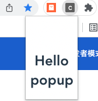
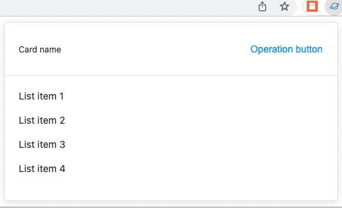
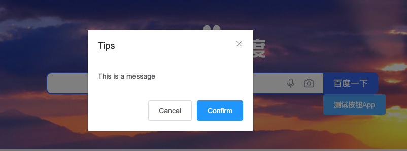

# Chrome插件开发全攻略

## 搭建环境

创建一个vue-cli3项目： vue create vue-extension，对话流程选择默认就行。   
进入项目
```
cd vue-extension  
```
安装. 
```
npm install vue-cli-plugin-chrome-ext -D
```
使用插件创建扩展脚手架，根据安装对话选项设置好。
```
vue add chrome-ext
```
  
删除vue-cli3无用文件跟文件夹：src/main.js，public、src/components   

## 运行项目

运行开发环境，对修改文件进行实时编译并自动在根目录下生成 dist 文件夹，然后在浏览器上加载 dist 文件夹完成插件安装。(注意：修改 background 文件跟 manifest.json 文件并不能实时刷新代码，需要重新加载插件才行)

```
npm run build-watch 
```

运行生产环境编译打包，将所有文件进行整合打包。
```
npm run build 
```

## 引入element UI

目前的插件加载到浏览器后弹出页面是这种界面：


平时我们肯定要引入好看的UI框架的，在这里我们可以引入 element-ui，首先安装：
```
npm install element-ui
```

考虑到插件打包后的文件大小，最后通过按需加载的方式来引入组件，按照 element-ui 官方的按需加载方法，要先安装 babel-plugin-component 插件:
```
npm install babel-plugin-component -D
```

然后，将 babel.config.js 修改为：

module.exports = {
 presets: [
 '@vue/app'
 ],
 "plugins": [
 [
 "component",
 {
 "libraryName": "element-ui",
 "styleLibraryName": "theme-chalk"
 }
 ]
 ]
}
接下来修改 popup 相关文件引入所需组件， src/popup/index.js 内容:
```
import Vue from "vue";
import AppComponent from "./App/App.vue";
Vue.component("app-component", AppComponent);
import {
 Card
} from 'element-ui';
Vue.use(Card);
new Vue({
 el: "#app",
 render: createElement => {
 return createElement(AppComponent);
 }
});
```

src/popup/App/App.vue 内容：
```
<template>
 <el-card class="box-card">
 <div
 slot="header"
 class="clearfix"
 >
 <span>卡片名称</span>
 <el-button
 style="float: right; padding: 3px 0"
 type="text"
 >操作按钮</el-button>
 </div>
 <div
 v-for="o in 4"
 :key="o"
 class="text item"
 >
 {{'列表内容 ' + o }}
 </div>
 </el-card>
</template>
<script>
export default {
 name: 'app',
}
</script>
<style>
.box-card {
 width: 300px;
}
</style>
```

渲染效果：


当然，不仅仅是插件内部的页面，还可以将 element-ui 组件插入到 content 页面。

content.js 使用 element-ui 组件

content.js 主要作用于浏览网页，对打开的网页进行插入、修改 DOM ，对其进行操作交互。别觉得 element-ui 只能配合 vue 使用，其实就是一个前端框架，只要我们引入了就能使用， webpack 会自动帮我们抽离出来编译打包。

首先我们创建 src/content/index 文件，内容：
```
import {
 Message,
 MessageBox
} from 'element-ui';
// 发现element的字体文件无法通过打包加载，所以另外通过cdn来加载样式
let element_css = document.createElement('link');
element_css.href = 'https://unpkg.com/element-ui@2.8.2/lib/theme-chalk/index.css'
element_css.rel = "stylesheet"
document.head.append(element_css)
MessageBox.alert('这是一段内容', '标题名称', {
 confirmButtonText: '确定',
 callback: action => {
 Message({
  type: 'info',
  message: `action: ${ action }`
 });
 }
})
```

vue.config.js 增加 content.js 文件的打包配置，因为 content.js （ background.js 同样可以只生成js文件）只有js文件，不用像app模式那样打包生成相应的 html 文件，完整内容如下：
```
const CopyWebpackPlugin = require("copy-webpack-plugin");
const path = require("path");
// Generate pages object
const pagesObj = {};
const chromeName = ["popup", "options"];
chromeName.forEach(name => {
 pagesObj[name] = {
 entry: `src/${name}/index.js`,
 template: "public/index.html",
 filename: `${name}.html`
 };
});
const plugins =
 process.env.NODE_ENV === "production" ? [{
 from: path.resolve("src/manifest.production.json"),
 to: `${path.resolve("dist")}/manifest.json`
 }] : [{
 from: path.resolve("src/manifest.development.json"),
 to: `${path.resolve("dist")}/manifest.json`
 }];
module.exports = {
 pages: pagesObj,
 // // 生产环境是否生成 sourceMap 文件
 productionSourceMap: false,
 configureWebpack: {
 entry: {
 'content': './src/content/index.js'
 },
 output: {
 filename: 'js/[name].js'
 },
 plugins: [CopyWebpackPlugin(plugins)]
 },
 css: {
 extract: {
 filename: 'css/[name].css'
 // chunkFilename: 'css/[name].css'
 }
 }
};
```

最后在 manifest.development.json 加载 content.js 文件：
```
{
 "manifest_version": 2,
 "name": "vue-extension",
 "description": "a chrome extension with vue-cli3",
 "version": "0.0.1",
 "options_page": "options.html",
 "browser_action": {
 "default_popup": "popup.html"
 },
 "content_security_policy": "script-src 'self' 'unsafe-eval'; object-src 'self'",
 "content_scripts": [{
 "matches": [
  "*://*.baidu.com/*"
 ],
 "js": [
  "js/content.js"
 ],
 "run_at": "document_end"
 }]
}
```

然后浏览器重新加载插件后打开 https://www.baidu.com/ 网址后可看到：



添加打包文件大小预览配置

既然用了 vue-cli3 了，怎能不继续折腾呢，我们平时用 webpack 开发肯定离不开打包组件预览功能，才能分析哪些组件占用文件大，该有的功能一个都不能少:sunglasses:。这么实用的功能，实现起来也无非就是添加几行代码的事：

// vue.config.js
```
module.export = {
 /* ... */
 chainWebpack: config => {
 // 查看打包组件大小情况
 if (process.env.npm_config_report) {
 // 在运行命令中添加 --report参数运行， 如：npm run build --report
 config
 .plugin('webpack-bundle-analyzer')
 .use(require('webpack-bundle-analyzer').BundleAnalyzerPlugin)
 }
 }
}
```

就辣么简单，然后运行
```
npm run build --report
```
看看效果：


完成结束！！

