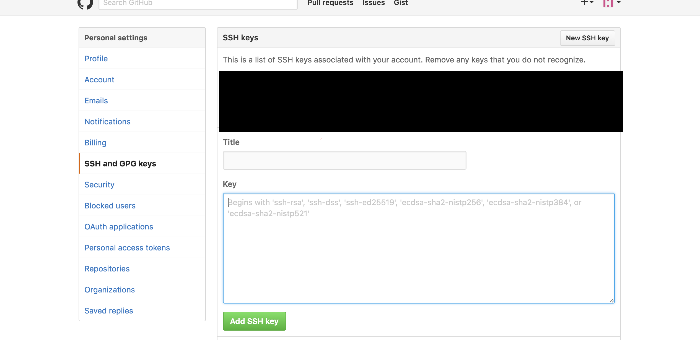

# git用户授权环境搭建

## 用户key生成

1.切换到.ssh目录
``` bash
cd ~/.ssh
```

2.使用自己的企业邮箱产生SSH KEY
``` bash
ssh-keygen -t rsa -C "XXX@email.com"
```

3.企业的可以使用id_rsa，也可以自己起名，例如：id_rsa_work
``` bash
Enter file in which to save the key (/Users/ltc/.ssh/id_rsa): id_rsa
```

4.将ssh key添加到SSH agent中
``` bash
ssh-add ~/.ssh/id_rsa
```

## 服务器授权
在生成ssh key之后，本例中remote链接为ssh（remote的url有两种模式，一种传统的https，一种是ssh）
以github为例：


在图中添加Title，可以随便写： 
* 将.ssh目录下对应的id_rsa_github.pub中的内容拷到Key中
* 点击Add SSH key按钮即可
* git私仓的类似

## 配置多用户

1.切换到.ssh目录
``` bash
cd ~/.ssh
```

2.创建并编辑config文件
``` bash
vim config
```

3.config内容如下：
   Host changyong	#远程地址ssh链接中@符号后边的值
   User git
   Hostname git.***.com  #私服的git地址
   IdentityFile ~/.ssh/id_rsa  #访问私服git的SSH KEY

   Host github
   User git
   Hostname github.com #github的地址
   IdentityFile ~/.ssh/id_rsa_github  #访问github的SSH KEY

4.测试配置
	* ssh -T git@github	#github值即为3步中的config的Host的值
	* 根据结果判断成功与否
	* 测试成功之后在.ssh文件夹下会生成名为known_hosts文件
	* github地址可能存在变化，所以在使用过程known_hosts会做变动
	
5.修改已pull的本地仓库
	* 在.git目录下有一个config
	* 修改[remote "origin"]下边的url即可
	* 新拉取的按照ssh的url修改@后边的host即可


