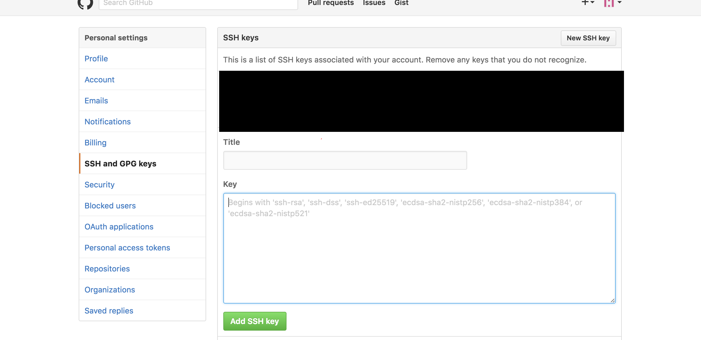

# git用户授权环境搭建

## 用户key生成

1.切换到.ssh目录   
``` bash
$ cd ~/.ssh
```

2.使用自己的企业邮箱产生SSH KEY   

``` bash
$ ssh-keygen -t rsa -C "XXX@email.com"
```

3.企业的可以使用id_rsa，也可以自己起名，例如：id_rsa_work    
``` bash
Enter file in which to save the key (/Users/ltc/.ssh/id_rsa): id_rsa
```

4.将ssh key添加到SSH agent中
``` bash
ssh-add ~/.ssh/id_rsa
```

## 服务器授权
在生成ssh key之后，本例中remote链接为ssh（remote的url有两种模式，一种传统的https，一种是ssh）
以github为例：


在图中添加Title，可以随便写： 
* 将.ssh目录下对应的id_rsa_github.pub中的内容拷到Key中
* 点击Add SSH key按钮即可
* git私仓的类似

## 配置多用户

1.切换到.ssh目录
``` bash
cd ~/.ssh
```

2.创建并编辑config文件
``` bash
vim config
```

3.config内容如下：
因为id_rsa权限文件多个用户存在多个，所以可以根据需要修改名称，或者存放到特定文件夹下  
> #user one.    
> #远程地址ssh链接中@符号后边的值，带端口号就加上.   
> Host changyong	   
> User git   
> #私服的git地址，有端口号这里不加，在克隆地址的Host:端口  
> Hostname git.***.com   
> #访问私服git的SSH KEY  
> IdentityFile ~/.ssh/id_rsa     
> 
> #user two.   
> Host github   
> User git    
> #github的地址  
> Hostname github.com  
> #访问github的SSH KEY    
> IdentityFile ~/.ssh/id_rsa_github    

4.测试配置   
​	* ssh -T git@github	#[github]即为3步中的config的Host的值   
​	* 根据结果判断成功与否   
​	* 测试成功之后在.ssh文件夹下会生成名为known_hosts文件   
​	* github地址可能存在变化，所以在使用过程known_hosts会做变动   
​	
5.修改已pull的本地仓库   
​	* 在.git目录下有一个config   
​	* 修改[remote "origin"]下边的url即可   
​	* 新拉取的按照ssh的url修改@后边的host即可   


