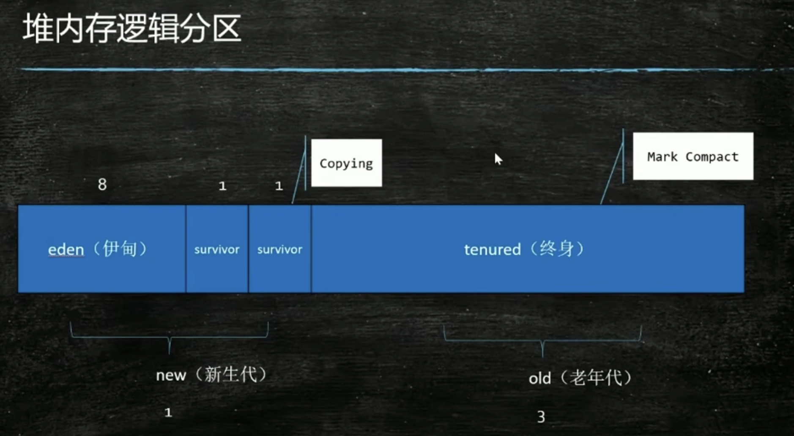
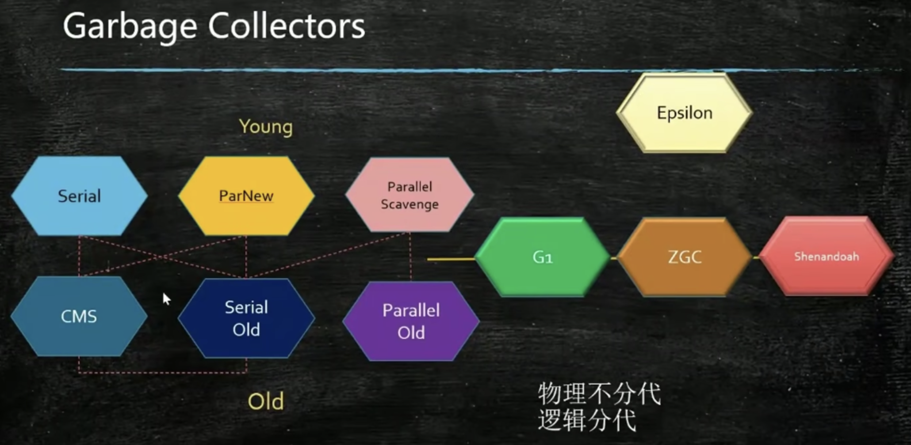

# jvm调优

注意：所有命令环境为Linux

## JVM内存模型
### 堆内存逻辑分代


## Garbage Collectors
### GC基本的三种算法
1、Mark Sweep 标记清除   
2、Copying 拷贝   
3、Mark Compact 标记压缩   
现在所有的GC都是围绕这三种算法开发

### 现在的GC分布历史


### 现用情况
1.8以前都是CMS居多，1.8（包括）之后基本都是G1，因为1.7的G1刚出来不稳定，所以在1.8之后最好设置为G1，其中CMS问题BUG比较多，容易FullGC导致的SWT（stop the world）

### 各种GC算法简单描述
1、Serial最开始简单的单线程来回扫描废弃的内存对象，年轻代的要么清除要么迁移到老年代，适合几M和几十M的内存情况（现在多客户端用）   
2、随着内存增加单线程搞不定，所以开始并行清除Parallel Scavenge，适合几十M、几百M以及1G的时候，1.8默认的是PS+PO组合GC    
3、继续随着内存增加，虽然并行了清除了，还是不行，需要并发处理Concurrent GC，适合几十G的内存，就是CMS的出现，以及后续出现的G1、ZGC等都是并发的GC，采用的是三色标记法
4、因为CMS问题BUG挺多，容易STW来FullGC，所以1.8以上基本使用G1，G1采用区域划分物理结构分区（逻辑结构不变，新生代/老年代），新生代区域可以直接升级为老年代

## java命令

### java命令输出的参数
#### 带--的为标准参数，带-X的为非标准参数
```
changyong@changyongdeMacBook-Pro ~ % java
用法: java [-options] class [args...]
           (执行类)
   或  java [-options] -jar jarfile [args...]
           (执行 jar 文件)
其中选项包括:
    -d32	  使用 32 位数据模型 (如果可用)
    -d64	  使用 64 位数据模型 (如果可用)
    -server	  选择 "server" VM
                  默认 VM 是 server,
                  因为您是在服务器类计算机上运行。


    -cp <目录和 zip/jar 文件的类搜索路径>
    -classpath <目录和 zip/jar 文件的类搜索路径>
                  用 : 分隔的目录, JAR 档案
                  和 ZIP 档案列表, 用于搜索类文件。
    -D<名称>=<值>
                  设置系统属性
    -verbose:[class|gc|jni]
                  启用详细输出
    -version      输出产品版本并退出
    -version:<值>
                  警告: 此功能已过时, 将在
                  未来发行版中删除。
                  需要指定的版本才能运行
    -showversion  输出产品版本并继续
    -jre-restrict-search | -no-jre-restrict-search
                  警告: 此功能已过时, 将在
                  未来发行版中删除。
                  在版本搜索中包括/排除用户专用 JRE
    -? -help      输出此帮助消息
    -X            输出非标准选项的帮助
    -ea[:<packagename>...|:<classname>]
    -enableassertions[:<packagename>...|:<classname>]
                  按指定的粒度启用断言
    -da[:<packagename>...|:<classname>]
    -disableassertions[:<packagename>...|:<classname>]
                  禁用具有指定粒度的断言
    -esa | -enablesystemassertions
                  启用系统断言
    -dsa | -disablesystemassertions
                  禁用系统断言
    -agentlib:<libname>[=<选项>]
                  加载本机代理库 <libname>, 例如 -agentlib:hprof
                  另请参阅 -agentlib:jdwp=help 和 -agentlib:hprof=help
    -agentpath:<pathname>[=<选项>]
                  按完整路径名加载本机代理库
    -javaagent:<jarpath>[=<选项>]
                  加载 Java 编程语言代理, 请参阅 java.lang.instrument
    -splash:<imagepath>
                  使用指定的图像显示启动屏幕
有关详细信息, 请参阅 http://www.oracle.com/technetwork/java/javase/documentation/index.html。
```

#### 其中java -X之后获取的为不常用的参数
```
changyong@changyongdeMacBook-Pro ~ % java -X
    -Xmixed           混合模式执行（默认）
    -Xint             仅解释模式执行
    -Xbootclasspath:<用 : 分隔的目录和 zip/jar 文件>
                      设置引导类和资源的搜索路径
    -Xbootclasspath/a:<用 : 分隔的目录和 zip/jar 文件>
                      附加在引导类路径末尾
    -Xbootclasspath/p:<用 : 分隔的目录和 zip/jar 文件>
                      置于引导类路径之前
    -Xdiag            显示附加诊断消息
    -Xnoclassgc        禁用类垃圾收集
    -Xincgc           启用增量垃圾收集
    -Xloggc:<file>    将 GC 状态记录在文件中（带时间戳）
    -Xbatch           禁用后台编译
    -Xms<size>        设置初始 Java 堆大小
    -Xmx<size>        设置最大 Java 堆大小
    -Xss<size>        设置 Java 线程堆栈大小
    -Xprof            输出 cpu 分析数据
    -Xfuture          启用最严格的检查，预计会成为将来的默认值
    -Xrs              减少 Java/VM 对操作系统信号的使用（请参阅文档）
    -Xcheck:jni       对 JNI 函数执行其他检查
    -Xshare:off       不尝试使用共享类数据
    -Xshare:auto      在可能的情况下使用共享类数据（默认）
    -Xshare:on        要求使用共享类数据，否则将失败。
    -XshowSettings    显示所有设置并继续
    -XshowSettings:system
                      （仅限 Linux）显示系统或容器
                      配置并继续
    -XshowSettings:all
                      显示所有设置并继续
    -XshowSettings:vm 显示所有与 vm 相关的设置并继续
    -XshowSettings:properties
                      显示所有属性设置并继续
    -XshowSettings:locale
                      显示所有与区域设置相关的设置并继续

-X 选项是非标准选项。如有更改，恕不另行通知。


以下选项为 Mac OS X 特定的选项:
    -XstartOnFirstThread
                      在第一个 (AppKit) 线程上运行 main() 方法
    -Xdock:name=<应用程序名称>"
                      覆盖停靠栏中显示的默认应用程序名称
    -Xdock:icon=<图标文件的路径>
                      覆盖停靠栏中显示的默认图标
```

#### 获取所有非标准参数（调优主要使用的参数）
```
java -XX:+PrintFlagsFinal -version
```
太多就不展示，使用wc查看结果行数，当前有735个参数
```
changyong@changyongdeMacBook-Pro ~ % java -XX:+PrintFlagsFinal -version | wc -l
java version "1.8.0_281"
Java(TM) SE Runtime Environment (build 1.8.0_281-b09)
Java HotSpot(TM) 64-Bit Server VM (build 25.281-b09, mixed mode)
     735
```

查看当前虚拟机使用的GC情况
```
java -XX:+PrintCommandLineFlags –version
```

## 排障
较流行的有阿里的[https://arthas.aliyun.com/doc/]工具，排障较为方便，而且对服务器性能影响小

### jps列出所有java程序

### jinfo列出java进程信息

### jstat内存分配情况
```
jstat -gc [pid]
```
### jstack查看线程情况

### jmap查看堆内存对象占用情况，dump堆内存文件离线分析
该命令为了打印当前快照会卡死jvm，所以生产慎重   
1、半夜等生产业务量少的时候
2、测试环境模拟压测
3、将流量复制tcpcopy一份到备份/测试机上执行
4、将有异常的机器或容器摘出来离线分析

```
jmap -histo [pid] | head -20 # 前20行的堆占用情况
```
```
jmap -dump:format=b,file=[name.hprof] [pid] # dump堆内存情况，离线用工具分析
```
一般安全起见，生产不做直接分析，防止影响生产业务，所以在JVM启动的时候配上参数-XX:+HeapDumpOnOutOfMemoryError，在JVM OOM的时候dump出堆内存快照

### top查看进程资源使用情况

### 排查过程
1、列出所有进程，找到最耗资源的进程和不稳定的进程
```
top   
```
2、列出进程内部的所有线程资源使用情况，找出异常线程
```
top -Hp [pid]  
```
```
3、用jstack查看线程情况
```
jstack [2查到的线程编号]
```


