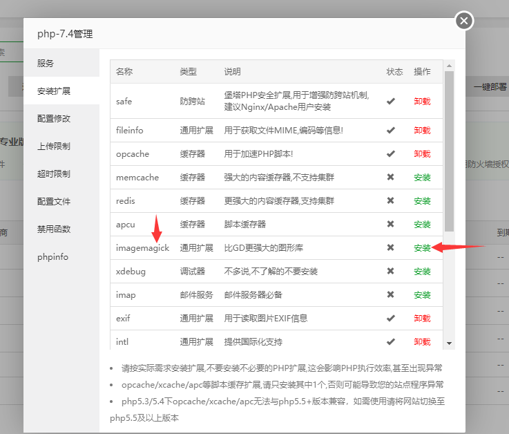
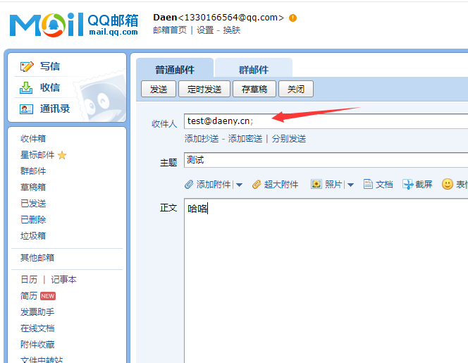

# 搭建邮箱服务器

## 1、准备一台Windows服务器
此文用的腾讯云的，北京地区

## 2、准备一个域名
（使用国内服务器需要备案）此文举例用的：daeny.cn

## 3、准备好邮局软件
下载地址：[Download - hMailServer - Free open source email server for Microsoft Windows](https://www.hmailserver.com/download)


## 4、准备好前端源码
下载地址：[Roundcube Webmail Downloads](https://roundcube.net/download/)


## 5、准备好Windows宝塔面板安装软件
下载地址：[宝塔面板下载，免费全能的服务器运维软件](https://www.bt.cn/new/download.html)


## 安装宝塔面板
此处省略，不过多介绍

## 放行安全组端口
8888（宝塔管理面板端口）
888（phpMyadmin端口）


## 创建数据库
### 安装套件
安装好宝塔之后，进入到宝塔控制面板
我这里选择的以下版本，安装，等待完成


### 查看root密码


## 安装邮局服务
一路下一步，到这里要刹住车，选第二个，因为我们用的MySQL


点击下一步，到这里要设置一下这个软件的密码，类似安全密码，我这里弄成了admin

点击下一步，会让你输入刚刚设置的密码，我刚刚设置的是admin
这里选第一个，创建一个hMailServer数据库

下一步，选择MySQL   


下一步，填写数据库信息
Database name是你要创建的数据库名称
下面的账号密码是root和root的密码

下一步，找到btPanel（btPanel），这个就是宝塔面板的意思


下一步，不出意外的话，会报错，提示缺少一个dll文件

没关系，正常，我上传这个文件到我博客了，点击下方链接下载这个文件
（博客园限制每天文件的下载流量，如果今天不能下载了，就等明天早点来）
https://files-cdn.cnblogs.com/files/blogs/693706/libmysql.zip
下载好后，解压，把dll放到hMailServer/Bin文件夹里

放好后，点击上一步
然后重新点击下一步，点击，完成，会自动打开hMailServer

选择第一个，点击connect，输入我们设置的管理员密码，admin

这样就安装成功了

## 设置汉化
先退出软件，下载chinese.ini，放到Languages文件夹里，下载后解压即可，我这里也提供了：[汉化文件包](https://files-cdn.cnblogs.com/files/blogs/693706/chinese.zip)


然后打开Bin目录的hMailServer.ini，加上,chinese

## 设置密码加密方式，不加密
还是那个文件，hMailServer.ini，在末尾加上
```
[Settings]    
PreferredHashAlgorithm=0 
```


保存后，打开任务管理器，切换到服务栏，找到hMailServer，右键，重启服务


然后重新打开hMailServer


切换语言，选择chinese，点击OK即可

在首页点击添加域名，然后点击保存


## 添加解析
添加一条mail记录A解析到你服务器IP


添加一条mail记录A解析到你服务器IP


添加一条@记录MX解析到主机名，上面设置的是mail，那么就是mail.daeny.cn.
注意后面有个英文句号


## 解析后的样子


## 去安全组放行端口
25,110,143,587   


## 添加一个账户
前缀为test，密码为test123   


## 上传源码，并解压


## 安装
访问 http://mail.daeny.cn/installer/  
进入到安装页面，有3个不OK，我们需要挨个解决一下


### 第一个


安装后，重启PHP  
然后刷新：http://mail.daeny.cn/installer/
看看是否OK，理论上是OK的

### 第二个
大概在914行，删掉前面的;号，意思就是取消注释，启用了，然后重启PHP，刷新安装页面，看看是否OK


### 第三个
安装后，重启PHP，看看是否OK，我这里反正全都绿了


## 配置信息
点击下一步，填写数据库信息  
   
勾选修改密码插件

## 测试
访问首页，正常就可以继续往下
   

## 配置修改密码插件
先别着急登录，先配置好

### 生效
 

去掉末尾的.dist，使之生效。

### 修改数据库连接，113行
 

### 修改SQL语句，138行
 
```
$config['password_query'] = 'UPDATE hm_accounts SET accountpassword=%p,accountpwencryption = 0 WHERE accountaddress=%u LIMIT 1';
```
保存

## 登录
输入test@daeny.cn，密码test123
 

成功啦

## 测试修改密码插件
 

### 手动退出登录，然后重新登录，大概率你会发现，连接失败了
 

别慌，这是自动封禁了，去服务器里，找到IP范围，删除你的账号即可

## 测试收信
用QQ邮箱往测试邮箱发送一封邮件
 

在我们的邮箱里刷新邮件，搞定啦

## 测试发信
我们这里回复刚刚收到的测试邮件
 

在QQ邮箱里看看，收到了没有

恭喜你，完成了自建邮局的搭建