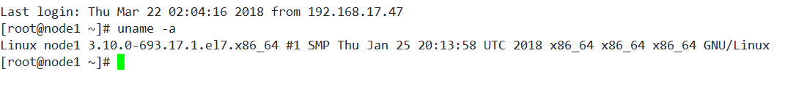
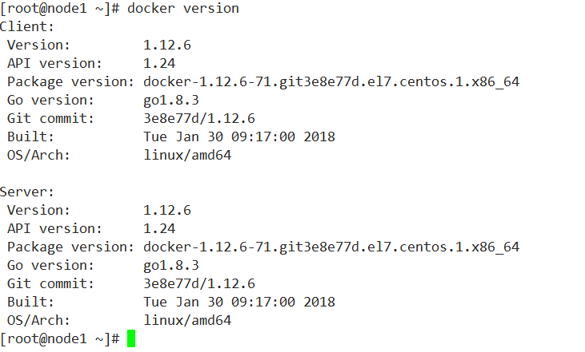
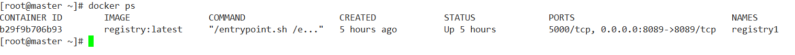
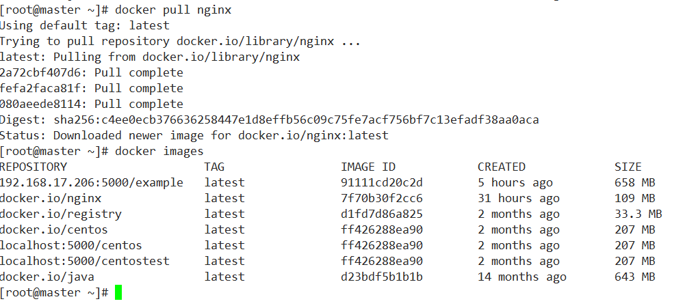

# 私仓搭建

## 安装环境
	以Centos7系统为例
	
### 查看系统内核版本
``` bash
uname -a
```

	
### Docker版本
``` bash
docker version
```

	
## 安装Docker Registry
	registry为docker私仓的镜像，拉取启动即为docker仓库   
	
``` bash
docker run -d -v /home/root/registry:/var/lib/registry -p 5000:5000 --restart=always --privileged=true --name registry registry:latest
```
	* -v /home/root/registry:/var/lib/registry 默认情况下，会将仓库存放于容器内的/var/lib/registry目录下，指定本地目录挂载到容器。   
	* -p 5000:5000 端口映射   
	* --restart=always1 在容器退出时总是重启容器,主要应用在生产环境   
	* --privileged=true 在CentOS7中的安全模块selinux把权限禁掉了，参数给容器加特权，不加上传镜像会报权限错误OSError: [Errno 13] Permission denied: ‘/tmp/registry/repositories/liibrary’)或者（Received unexpected HTTP status: 500 Internal Server Error）错误   
	* --name registry 指定容器的名称

	查看启动容器
``` bash
docker ps
```

	
## 使用Docker Registry
### 先拉去一个nginx镜像
``` bash
docker pull nginx
```

### 使用tag命令修改标签
``` bash
docker tag nginx localhost:5000/nginx
```
### 推送到仓库
``` bash
docker push localhost:5000/nginx
```
	
### 开启docker远程API
#### 修改docker配置文件
``` bash
vi /usr/lib/systemd/system/docker.service
```
	进入编辑模式后   
	将ExecStart这一行后面加上 -H tcp://0.0.0.0:2375 -H unix:///var/run/docker.sock      
	改完后如下所示   
	ExecStart=/usr/bin/dockerd -H tcp://0.0.0.0:2375 -H unix:///var/run/docker.sock    
	这里就写4个0，表示任意ip，保存后退出
#### 重新加载配置文件
``` bash
systemctl daemon-reload
```
#### 重新启动docker
``` bash
systemctl restart docker  
```
	
	
	
	
	
	
	
	
	
	
	
	
	
	

