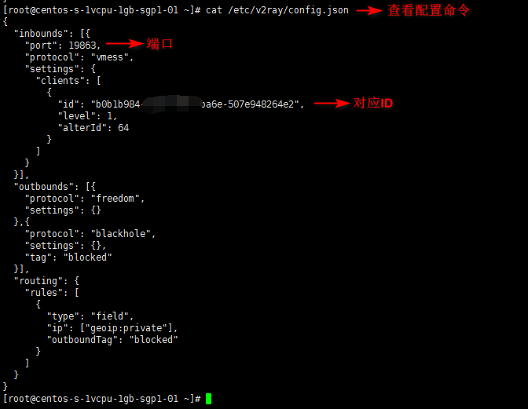
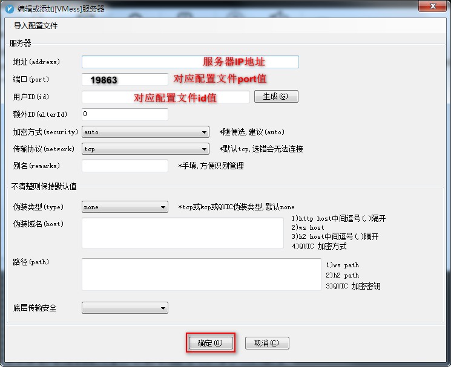

# 一键搭建 V2Ray

## 前言
此教程面向小小白萌新，从购买 VPS 到使用 SSH 登录并安装和配置 V2Ray，尽量详细一些，老鸟请自行飞过。

## 第一部分：环境信息
* 服务器系统：CentOS 7.5 x64 ；CentOS 7 以上版本系统兼容本教程
* v2ray版本：v4.17.0
* 客户端系统：Windows 10
* VPS:我使用的是Vultr

## 第二部分：创建服务器
是一个服务器就行，这块话不多说，玩这个的人懂的，不懂服务器你还来装这个就太能装了。

## 第三部分：JuiceSSH或Xshell连接服务器
准备好你的服务器，确认账号（一般是root）和密码，系统建议Centos7 ×64

## 第四部分：V2Ray搭建
服务代码GitHub地址：https://github.com/Jrohy/multi-v2ray

安装命令：

输入以下命令，回车执行（shift+insert可粘贴）
```
source <(curl -sL https://multi.netlify.app/v2ray.sh) --zh
```
显示一下信息代表安装成功（可直接用以下配置进行连接）:

```
Group: A
IP: 42.3.5.62
Port(端口): 10689
TLS: 关闭
UUID: 7d0b1586-169b-11eb-a3d8-5028e257d
Alter ID: 0
Network(传输协议): kcp
type(伪装类型)：utp

vmess://eyJ2IjogIjIiLCAiQiOiAiIiwgImlkIjogQ4LTU2MDAwMjhlMjU3ZCIsICJ0bHMiOiAibm9uZSJ9
```

配置文件要注意：

Network(传输协议): kcp   
type(伪装类型)：utp   
不对的话连不上！！！   

好了到这里我们就搭建成功了  

相关命令：

关于软件更新，升级命令(保留配置文件更新)：
```
source <(curl -sL https://multi.netlify.app/v2ray.sh) -k
```
卸载命令：
```
source <(curl -sL https://multi.netlify.app/v2ray.sh) --remove
```

其他命令：
```
## 启动
service v2ray start

## 停止
service v2ray stop

## 重启
service v2ray restart ## 查看状态 service v2ray status
```

vmess协议配置

查看配置文件(该配置在后面链接时使用):
```
cat /etc/v2ray/config.json
```



## 第五部分：客户端链接V2Ray
各平台的v2ray客户端地址：

客户端：下载v2rayN.zip

【v2rayN-v2rayN.exe-Github Release】 https://github.com/2dust/v2rayN/releases

内核：下载v2ray-windows-64.zip文件，注意版本和上面服务端版本要一致！！！

【v2ray-windows-64.zip Github Release】 https://github.com/v2ray/v2ray-core/releases/tag/v4.25.0

对v2ray-windows-64.zip 和 v2rayN 进行解压，然后将 v2rayN 目录下所有文件复制到v2ray-windows-64解压后的目录，即两个下载好的文件需要在同一目录。

【【【点击v2rayN.exe启动】】】

注意电脑右下角 V 图标，双击图标，点右上角 服务器 ，添加[VMess]服务器。


进行配置:

客户端的配置需要根据你的服务端进行相应的配置，因为你的服务端协议可能是vmess等。

如果你的服务端配置是协议vmess，则配置如下：（这里传输协议把tcp改为kcp,伪装协议改为kcp）



保存后，右键电脑右下角 V 图标


Android v2ray客户端：

需要你去网上找设备相应的CPU架构并进行选择下载：
https://github.com/2dust/v2rayNG/releases

使用方法:
```
(1）打开 v2rayNG APP
(2）点击右上角 + 号
(3）选择 手动输入[Vmess]
(4）别名随意，地址(填服务器外网IP地址)，端口(你设置的V2Ray端口)，用户ID,额外ID:0,加密方式:auto,其他设置默认
(5）右上角 √ 保存
(6）右下角 V图标 点击启动.
(7）打开浏览器试试吧COPY
```

MacOS v2ray客户端:
https://github.com/Cenmrev/V2RayX/releases


Linux内核 v2ray客户端：
Debian、Ubantu、CentOS等电脑桌面发行版（不能完全通用，可以尝试一下）
https://github.com/jiangxufeng/v2rayL/releases


IOS v2ray客户端：
需要国外账号，推荐shadow（小火箭）rocket，quantumult（圈），kitsunebi

测试
打开浏览器，访问www.google.com，如下：


v2ray搭建教程到此结束，祝大家春风得意！

## 第六部分：v2ray提速之BBR(扩展)(可选)

什么是BBR？
Google 开源了其 TCP BBR 拥塞控制算法，可以使Linux服务器显著地提高吞吐量和减少TCP连接的延迟，并提交到了 Linux 内核，从 4.9 开始，Linux 内核已经用上了该算法。

开源地址： https://github.com/google/bbr

部署最新版内核，开启TCP BBR 加速的 VPS，网速可以提升几个数量级。

网上也有很多教程，我使用的是被称之为bbr修正版，或者bbrplus。

原文地址：https://github.com/cx9208/bbrplus

大家自行了解，这里我只列出我选择的使用方法；

BBR一键脚本（仅CentOS）：
命令行执行：
```
wget "https://github.com/cx9208/bbrplus/raw/master/ok_bbrplus_centos.sh" && chmod +x ok_bbrplus_centos.sh && ./ok_bbrplus_centos.sh
```
这个过程可能要几分钟;

以上过程要求重启系统，输入“Y”回车即可了。

安装后，执行uname -r，显示4.14.129-bbrplus则切换内核成功

执行lsmod | grep bbr，显示有bbrplus则开启成功

注意：以上作者说“不要在生产环境使用一键脚本，建议手动安装，进不了系统用vnc切内核”，但是我就是这么做了，也没出问题，还是建议大家注意点，以免出现意外，进行之前，一定要注意备份系统快照，出现问题，可以进行恢复，这一点无比重要。

